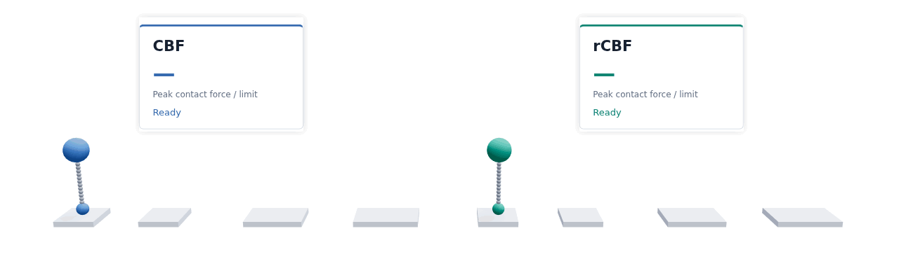

<h1 align="center">Safety-critical control for smoothed implicit contact dynamics</h1>

<!-- <p align="center"><strong>Safety-critical control for smoothed implicit contact dynamics</strong></p> -->

<p align="center">
  Haegu Lee · Yitaek Kim · Christoffer Sloth<br>
  <a href="https://ieeexplore.ieee.org/document/11704662">IEEE Robotics and Automation Letters (RA-L), 2026</a>
</p>

<p align="center">
  
</p>

<p align="center">
  <a href="https://arxiv.org/abs/2605.21138"></a>
  <a href="https://ieeexplore.ieee.org/document/11704662"></a>
  <a href="pyproject.toml"></a>
</p>

<p align="center">
  <a href="#features">Features</a> ·
  <a href="#installation">Installation</a> ·
  <a href="#examples">Examples</a> ·
  <a href="#kappa-selection">κ selection</a> ·
  <a href="#citation">Citation</a>
</p>

This repository implements the method in [Safety-Critical Control for Smoothed Implicit Contact Dynamics](https://arxiv.org/abs/2605.21138) for box contact, planar push, box pivot, and hopper.

## Features

- Smoothed implicit contact simulation with C++ model residuals and Jacobians.
- Implicit contact-force sensitivities and standard CBF filtering.
- Fixed-margin robust CBF (rCBF) filtering and boundary-focused κ selection.
- Runnable numerical examples for all four systems.

For a contact force γ and limit F_max, the safety margin is h = F_max − γ. Here γ is the measured normal force and F_max is its limit. The CBF constrains the predicted next margin to at least (1 − α)h at the current step, where α is the barrier decay factor. The rCBF adds a fixed margin δκ to that bound, where δκ is calibrated from force under-prediction. Algorithm 1 evaluates candidate κ values using near-boundary rollouts and predicted-versus-realized margins.

## Installation

Linux, Python 3.10–3.12, `uv`, and a C++17 compiler are required. From the repository root:

```bash
uv sync --locked
bash scripts/build_residuals.sh
```

The four model residuals and Jacobians are implemented in `src/residual_models/native/` and loaded by the Python bindings in `src/residual_models/`. Contact solves, implicit sensitivities, CBF/rCBF filters, and κ selection are in Python.

## Examples

These commands run the four examples with bundled settings and save numerical rollout data. Run them from the repository root after building the C++ libraries.

```bash
uv run python -m example.particle_p_cbf_new \
  --alpha 0.95 --kappa 5e-5 --fmax 0.25 \
  --delta-kappa 5e-4 --delta-scale 1 \
  --out-data results/particle.npz --out-summary results/particle.json

uv run python -m example.planar_push_linear_cimpc_cbf_fixed_delta \
  --alpha 0.95 --kappa 1.0414058246057907e-4 \
  --delta-kappa 2.4121606983426238e-5 --delta-scale 1 \
  --out-json results/planar.json

uv run python -m example.tipover_push_ref_cbf_fixed_delta \
  --alpha 0.95 --kappa 5e-4 --f-max 0.9 \
  --delta-kappa 0.019 --delta-scale 1 \
  --out-data results/tipover.npz --out-summary results/tipover.json

uv run python -m example.hopper_simulate_test_before_cbf_fixed_delta \
  --alpha 0.95 --kappa 3e-4 --delta-kappa 0.094 --delta-scale 1 \
  --out-dir results/hopper
```

The saved force series are `cbf/gamma_actual` and `rcbf/gamma_actual` in `particle.npz`, `cbf_gamma_safe` and `rcbf_gamma_safe` in `planar.json`, `*/gamma_corner0` in `tipover.npz`, and `gamma` in each hopper mode JSON. Compare them with the force limits 0.25, 0.245, 0.9, and 1.3, respectively.

The planar-push, box-pivot, and hopper examples use inputs in `reference_trajectory/`; the box-contact example generates its nominal input from a fixed seed. The planar CI-MPC path used for the κ sweep remains in `src/mpc/`.

## Kappa selection

### Selection

The four Algorithm 1 entry points are:

```bash
uv run python -m scripts.run_particle_contact_risk_constrained_kappa_selection --alpha 0.95 --f-max 0.25
uv run python -m scripts.run_planar_push_risk_constrained_kappa_selection --alpha 0.95 --f-max 0.245
uv run python -m scripts.run_box_pivot_risk_constrained_kappa_selection --alpha 0.95 --f-max 0.9
uv run python -m scripts.run_hopper_risk_constrained_kappa_selection --alpha 0.95 --f-max 1.3
```

Selection uses the bundled screening scenarios and reference inputs.

### Sweep

The following command evaluates all four systems on a 20-point κ grid and saves the safety-margin data:

```bash
uv run python -m scripts.analyze_kappa_safety_region \
  --kappa-min 1e-6 --kappa-max 1e-3 --num-kappa 20 \
  --particle-alpha 0.95 --planar-alpha 0.95 \
  --tipover-alpha 0.95 --hopper-alpha 0.95 --hopper-fmax 1.3 \
  --out-json results/kappa_safety_region.json
```

The script also writes intermediate planar and hopper rollouts under `/tmp/kappa_safety_region/`.

The examples demonstrate the method on the bundled trajectories; their numerical results may differ from the paper's tables. For box contact and planar push, `gamma_nom` contains one-step predictions along the CBF rollout, not a separate nominal rollout.

## Source layout

| Path | Purpose |
| --- | --- |
| `src/residual_models/` | Native contact residuals, Jacobians, and Python bindings |
| `src/robots/`, `src/simulator/`, `src/solver/` | Models, smoothed contact simulation, and implicit solves |
| `src/mpc/` | Contact-implicit MPC for the planar κ sweep |
| `example/` | CBF/rCBF filters and four numerical comparisons |
| `scripts/` | Algorithm 1, κ safety-region evaluation, and native-library build |
| `reference_trajectory/` | Bundled experiment inputs |

## Citation

```bibtex
@misc{lee2026safecontact,
  title         = {Safety-Critical Control for Smoothed Implicit Contact Dynamics},
  author        = {Lee, Haegu and Kim, Yitaek and Sloth, Christoffer},
  year          = {2026},
  eprint        = {2605.21138},
  archivePrefix = {arXiv},
  url           = {https://arxiv.org/abs/2605.21138}
}
```
